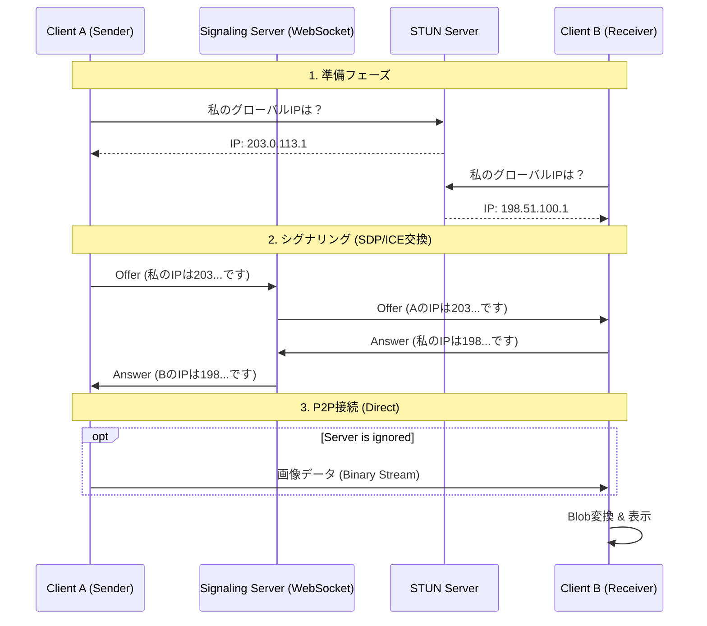

# WebDrop
**WebDrop**は，ブラウザだけで動作するP2Pファイル転送アプリケーションです．
AirDropのように，サーバーにファイルを保存することなく，端末同士が直接通信して画像を送受信できます．

## 特徴
* **サーバーレス転送:** ファイルデータはサーバーを経由せず，WebRTCを使って端末間で直接転送されます．
* **クロスプラットフォーム:** iOS，Android，Windows，MacOSなど，さまざまな端末で動作します．
* **リアルタイム接続:** WebRTCを使用したシグナリングにより，リアルタイムで接続を確立します．

## 技術スタック
* **Frontend:** HTML5, CSS3, JavaScript (WebRTC API)
* **Backend (Signaling):** Python 3.x, FastAPI, WebSockets
* **Infrastructure:** Uvicorn (ASGI Server)

## セットアップと実行方法
### 1. 前提条件
Python 3.7以上がインストールされていること．
### 2. インストール
必要なPythonライブラリのインストール
```bash
pip install -r requirements.txt
```
### 3. サーバーの起動
以下のコマンドでシグナリングサーバーを立ち上げます．
#### **ローカル(PCのみ)で試す場合:
``` bash
uvicorn server:app --reload
```
#### **スマホなど他の端末とも通信する場合:**
``` bash
uvicorn server:app --host 0.0.0.0
```

### 4. ブラウザでアクセス
- **PC**: http://localhost:8000
- **スマホ**: http://<PCのIPアドレス>:8000

## 仕組み
WebDropは，シグナリングサーバーと呼ばれるPythonのFastAPIサーバーを介して，WebRTCを使用して端末間で直接通信して画像を送受信します．
### Phase 1: シグナリング
1.  **SDP (Session Description Protocol) の交換:**
    * 「私は動画を受信できます」「コーデックはVP8です」といった接続能力情報を交換します。
    * Offer (送信側) → Server → Answer (受信側) の順でリレーされます。
2.  **ICE Candidate の交換 (Trickle ICE):**
    * 通信可能な経路候補（ローカルIP、グローバルIPなど）が見つかるたびに、サーバー経由で相手に通知します。
### Phase 2: 経路解決
多くの端末はプライベートIPのいるため，直接通信することができません．Googleの公開STUNサーバーに問い合わせることで，自身のグローバルIPアドレスとポート番号を取得し，SDPに含めます．
### Phase 3: P2P接続
接続確立後，シグナリングサーバーは通信に関与しなくなります．
* **RTCDataChannel:**
    * ブラウザ間に確立されたUDPベースのパイプライン
    * 画像ファイルはFile APIで読み込まれ，ArrayBuffer(バイナリデータ)としてパケット分割されずに直接相手のメモリへ送信されます．


## 今後の実装予定
現在提供しているのは，MVP機能です．実用性を高めるため，以下の機能を実装予定です．
- [ ]ルーム機能の実装
    - 現在は接続者全員にブロードキャストされますが，IDを知っている特定の相手とだけつながるルーム機能を追加し，セキュリティを向上させます．
- [ ]ファイル転送機能の拡張
    - 数百MB以上の動画ファイルなどを送るとブラウザがクラッシュするので，データをチャンクにして送信・結合する機能を実装します．
- [ ]プログレスバーの表示
    - ファイル転送中に進行状況を表示するプログレスバーを実装します．
- [ ]テキストチャット機能
    - メッセージを送受信するテキストチャット機能を実装します．